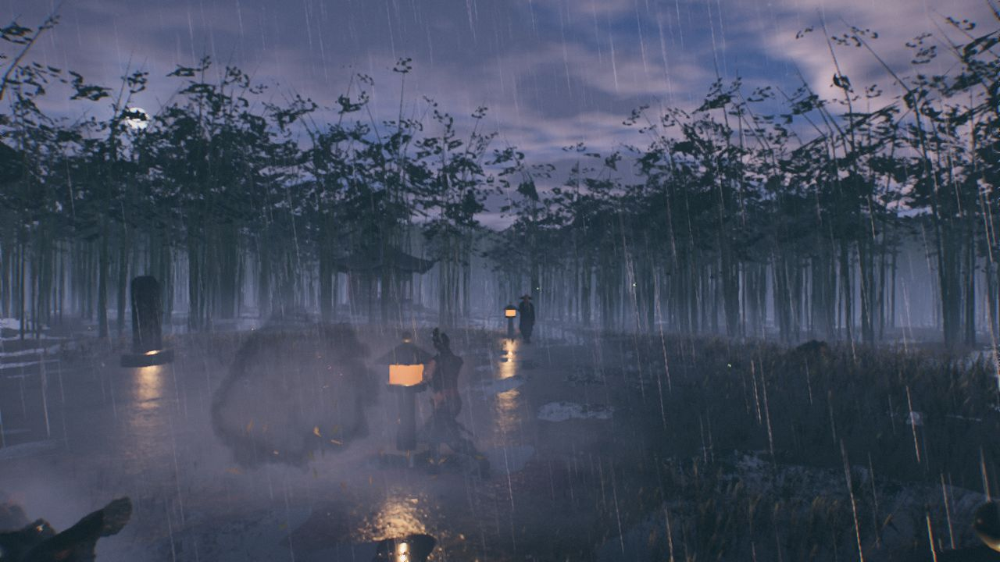

<div align="center">

# 长风 · Long Wind

**一个在浏览器里运行的实时武侠动作游戏 —— 全部代码由 Claude Opus 5.5 在一天一夜里写成**

*A real-time wuxia action game in the browser. Every line of code written by Claude Opus 5.5 in about a day.*

### [▶ 在线试玩 Play in browser](https://jbang2004.github.io/long-wind/)


 

</div>

---

## 这是什么

一名剑客，三章旅程，纯 three.js / WebGL，打开网页就能玩，不需要安装。

| 章 | 场景 | Boss |
|---|---|---|
| 一 · 长风 | 黄昏逆光的金色草原，风吹草浪，孤树与石碑 | 寒山客 |
| 二 · 竹林夜雨 | 雨夜竹林，闪电、积水倒影、石灯笼 | 夜枭（会隐身闪现的刺客） |
| 三 · 长街灯火 | 江南古镇长街，五百盏灯笼，河道石桥，会惊慌躲避的市民 | 寒山客 · 戏台前决战 |

战斗：轻重连击、格挡与完美弹反、闪避无敌帧、架势崩溃与处决、剑气、击飞击倒、锁定、弓手/盾兵/枪兵/刺客等不同敌人。

## 它是怎么做出来的

**我没有写代码。** 我只用中文向 Claude Code（Opus 5.5）描述想要什么、试玩、提意见；设计、编码、调试、测试、性能优化都由 AI 完成。Opus 5.5 作为总负责，把工作拆给多个并行的子代理（地形、草、天空、角色、战斗、音频、UI……），用一份接口契约（[CONTRACTS.md](CONTRACTS.md)）和美术圣经（[docs/BIBLE.md](docs/BIBLE.md)）让它们协同，再亲自集成、截图验收、返工。

**真实时间线**（北京时间，来自会话记录）：

| 时间 | 进展 |
|---|---|
| 9/24 17:29 | 第一条提示："用 three.js 参考这个网站的视觉效果，实现一个剑客在草原上战斗的游戏，要求极致的逼真，极致的美学设计" |
| 9/24 晚 | 草原、草浪、天空、后期管线、程序化角色、战斗系统、敌人波次 —— 第一个可玩版本 |
| 9/24 深夜 – 9/25 凌晨 | 反复打磨剑客动作；从一段中国剑演示视频中提取姿态做动作捕捉并重定向到骨骼 |
| 9/25 上午 | 用 Tripo AI 生成角色模型与动画并接入；跳斩、空中翻滚斜劈等招式；第一轮性能优化；敌人模型 |
| 9/25 中午 | 打击感：顿帧、震屏、方向受击、击飞击倒、合成打击音效和喊杀声；逐个角色排查不自然动作 |
| 9/25 下午 | 画质档位、TAA 超分辨率、找出 GC 卡顿根因；关卡系统 + 第二章「竹林夜雨」+ Boss 夜枭 |
| 9/25 21:12 | 第三章「长街灯火」：古镇、河道、市民 AI，完成 |

合计墙钟约 **28 小时**，其中 AI 实际工作约 **19 小时**。

**一些数字**

- 约 **37,000 行** JavaScript / GLSL，148 个源文件，只有一个运行时依赖（three.js）
- **没有一个音频文件**：音乐、打击声、雨声、雷声、人声、市井喧哗全部用 WebAudio 实时合成
- 地形、草、竹林、古镇建筑、天气、市民、大部分动作片段都是程序化生成
- 30 项无头玩法测试（`npm test`）

**AI 自己查出来的几个有意思的问题**

- *所有敌人一起闪白*：多个敌人共用同一份 GLB 材质，一个被打中，全部变白。改成每个角色克隆材质。
- *打起来就卡顿*：追到根因是 V8 —— three.js 的矩阵数组在加载 GLB 时被"泛化"成通用数组，之后每次矩阵乘法都在分配 HeapNumber，每秒约 80 MB 垃圾。把矩阵存储换成 Float64Array 后分配量降到原来的约 1/4（见 [src/core/matrixFix.js](src/core/matrixFix.js)）。
- *枪兵横扫时枪头插进地里*：两个关键帧方向夹角超过 110°，插值走了"近路"穿过地面。重写了起手方向。

**人做了什么**：提出方向和审美要求、试玩并指出哪里不自然、录了一段参考视频、登录 Tripo 账号并授权 AI 使用额度。

## 操作

| 键 | 动作 | | 键 | 动作 |
|---|---|---|---|---|
| WASD | 移动 | | 鼠标左键 | 斩（按住：重击） |
| 鼠标 | 视角 | | 鼠标右键 | 格挡（命中瞬间：弹反） |
| Space | 闪避 | | Shift | 疾跑 |
| Q / Tab | 锁定 | | E | 剑气 |
| F | 拔剑 / 收剑 | | Esc | 暂停（可切换画质与章节） |

**手机 / 平板**：触屏设备自动显示水墨风格的虚拟按键 —— 左手拇指在屏幕左侧任意位置按下即出现摇杆（推过外圈为疾跑），右侧空白处滑动转视角；右下角：斩（按住蓄力重击）、闪、格（命中瞬间按下弹反）、气、锁、剑，右上角暂停。建议横屏游玩。`?touch=1` 强制显示，`?touch=0` 关闭。

**录屏模式**：`H` 隐藏界面 · `O` 环绕运镜 · `T` 慢动作。

常用网址参数：`?level=steppe|bamboo|town` 选章 · `?demo=1` AI 自动战斗（适合录素材）· `?hud=0` 无界面 · `?q=low|med|high` 画质。

## 本地运行

```bash
npm install
npm run dev      # http://127.0.0.1:5173
npm test         # 玩法测试
npm run build    # 静态站点输出到 dist/
```

推荐桌面版 Chrome / Edge，独立显卡更佳；卡顿时在暂停菜单切到"流畅"。

---

## English

**Long Wind** is a third-person wuxia action game running in the browser (three.js / WebGL, no install). Three chapters — a golden-hour steppe, a bamboo forest in a night storm, and a lantern-lit canal town full of townsfolk who scatter when swords are drawn — with light/heavy combos, parries, dodges, posture breaks and executions, launches and knockdowns, and five enemy types plus bosses.

**No human wrote the code.** The author described what they wanted in Chinese, played the builds, and gave feedback; Claude Opus 5.5 in Claude Code did the design, code, debugging, tests and performance work, coordinating parallel sub-agents through an interface contract ([CONTRACTS.md](CONTRACTS.md)) and an art bible ([docs/BIBLE.md](docs/BIBLE.md)). From the first prompt (Sep 24, 17:29 CST) to the third chapter (Sep 25, 21:12 CST): ~28 hours wall clock, ~19 hours of active agent time.

- ~37k lines of JS/GLSL in 148 files; one runtime dependency (three.js)
- Zero audio files: music, impacts, rain, thunder, voices and crowd noise are synthesized live with WebAudio
- Terrain, grass, bamboo, the town, weather, townsfolk and most animation clips are procedural
- Character models were generated with Tripo AI (see [CREDITS.md](CREDITS.md))

**Phones and tablets** get on-screen ink-brush controls: a floating left thumb-stick (push past the rim to sprint), drag on the right to look, and a fan of 斩 strike (hold: heavy) · 闪 dodge · 格 block/parry · 气 sword qi · 锁 lock · 剑 draw buttons; landscape recommended (`?touch=1` forces them, `?touch=0` hides them).

**Record mode:** `H` hides the HUD, `O` orbit camera, `T` slow motion. URL: `?level=steppe|bamboo|town`, `?demo=1` (AI plays), `?hud=0`, `?q=low|med|high`.

## License

Source code: [MIT](LICENSE). Third-party assets keep their own licenses — the Poly Haven textures/models are CC0, and the character models in `public/assets/models/` are **not** MIT-licensed (generated with Tripo AI; see [CREDITS.md](CREDITS.md)).
